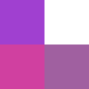

# PixelShapes



- I - Introduction
- II - Download
- III - Use
- IV - About

---
### I - Introduction

This project aims to create usable pixel shapes. A pixel shape is a collection of integer coordinates. Think of it like opening MSPaint and using black on a white background ; the black pixels make up a pixel shape. 

---
### II - Download

__Gradle__

In `build.gradle` :

```gradle
allprojects {
	repositories {
		/*...*/
		maven { url 'https://jitpack.io' }
	}
}
```

```gradle
dependencies {
    implementation 'com.github.MaxBuster380:PixelShapes:alpha-1.5.1'
}
```

__Maven__

In `pom.xml` :
```xml
<repositories>
	<repository>
	    <id>jitpack.io</id>
	    <url>https://jitpack.io</url>
	</repository>
</repositories>
```

```xml
<dependency>
    <groupId>com.github.MaxBuster380</groupId>
    <artifactId>PixelShapes</artifactId>
    <version>alpha-1.5.1</version>
</dependency>
```

---
### III - Use

A shape is a set of 2-dimensional integer values. As such, they can all be used as a standard `Set<Pair<Int, Int>>`.

#### Interfaces

All pixel shapes implement the `PixelShape` interface :

```kotlin
interface PixelShape : Set<Pair<Int, Int>>
```

A pixel shape is, by default, read-only. Read/write pixel shapes implement the `MutablePixelShape` interface :

```kotlin
interface MutablePixelShape : PixelShape, MutableSet<Pair<Int, Int>>
```

You can also group shapes together with a `CollectionPixelShape` :

```kotlin
interface CollectionPixelShape<T : PixelShape> : PixelShape
```

#### Implementations

The `SetMutablePixelShape` is an implementation that uses a regular `MutableSet`, and thus keeps its time efficient
operations. Although very good for most tasks, it requires every value to be inputted one at a time.

```kotlin
val setShape = SetMutablePixelShape()
setShape += Pair(0, 0)
setShape += Pair(1, 0)
setShape += Pair(0, -1)

println(setShape.contains(Pair(1, 0))) // true
println(setShape.contains(Pair(1, 1))) // false
println(setShape.size) // 3

for (point in setShape) {
    print("(${point.first}, ${point.second}), ")
}
// (0,0), (1,0), (0,-1)
```

The `BoxPixelShape` is set of points that form a rectangle. While it is restricted to only make such forms, it is more
time and space efficient to instanciate than the `SetMutablePixelShape`, meaning quicker access to its values.

```kotlin
val origin = Pair(0, 0)
val width = 3
val height = 2
val boxShape = BoxPixelShape(origin, width, height)

println(boxShape.size) // 6

for (point in boxShape) {
    print("(${point.first}, ${point.second}), ")
}
// (0,0), (1,0), (2,0), (0,1), (1,1), (2,1),
```

Now, if you want to group shapes together, there are two options. `UnionPixelShape` allows you to get the mathematical
union between a collection of shapes, meaning all points included in at least 1 of its member shapes is considered "
Included".

```kotlin
val union = UnionPixelShape(listOf(setShape, boxShape))

println(union.size) // 7

for (point in boxShape) {
    print("(${point.first}, ${point.second}), ")
}
// (0,-1), (0,0), (1,0), (2,0), (0,1), (1,1), (2,1),
```

Then there's the `IntersectionPixelShape`, which holds the points included in all its member shapes.

```kotlin
val intersection = IntersectionPixelShape(listOf(setShape, boxShape))

println(intersection.size) // 2

for (point in boxShape) {
    print("(${point.first}, ${point.second}), ")
}
// (0,0), (1,0), 
```

To put it simply, `UnionPixelShape` is an OR operator, while `IntersectionPixelShape` is an AND operator.
For these, note that a `CollectionPixelShape` does not compile shapes together, meaning you can change them and it'll
apply on the collection. This also means that a `CollectionPixelShape` is less and less efficient the more member shapes
it has.

The most basic implementation is the `EmptyPixelShape`, an efficient and dedicated way to make and use empty sets.

```kotlin 
val shape = EmptyPixelShape()
println(shape.size) // 0
println(shape.contains(Pair(1, 0))) // false
```

### IV - About

By MaxBuster380

[GitHub Repository](https://github.com/MaxBuster380/PixelShapes)